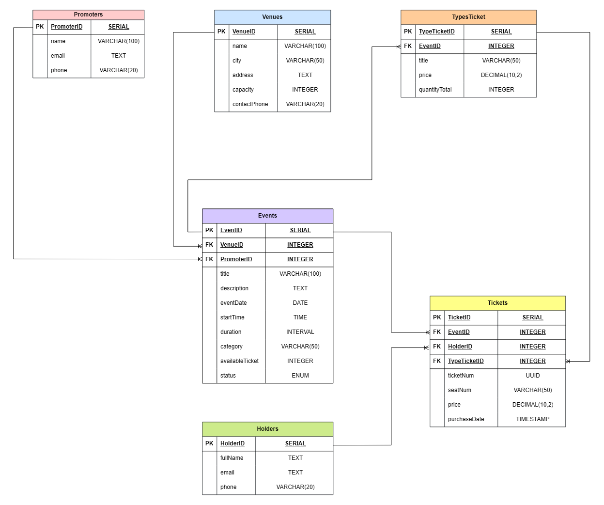

# Part 1: Выбор сценария

Для данной работы выбран сценарий: **_Продажа билетов на мероприятия_**. Эта система будет управлять площадками, организаторами, мероприятиями, типами билетов и посетителями, а также фиксировать купленные билеты.

**Цель:** спроектировать БД, которая позволяет управлять полным циклом продажи билетов на мероприятия: от создания мероприятия до покупки билета конкретным посетителем.

**Система решает следующие задачи:**

- хранение информации о площадках и их вместимости;
- хранение информации об организаторах и мероприятиях, которые они проводят;
- разделение билетов на категории (типы) с определенной ценой и количеством для каждого мероприятия;
- контроль того, что в продажу не может поступить больше билетов, чем вмещает площадка;
- хранение данных о посетителях и билетах, которые они приобрели;
- предотвращение возможности продать одно и тоже место на мероприятие дважды.

# Part 2: Проектирование БД и документации

## Идентификация сущностей и атрибутов

- Организаторы (Promoters)
- Площадки (Venues)
- Мероприятия (Events)
- Посетители (Holders)
- Билеты (Tickets) — для отслеживания, кто какой билет купил
- Типы билетов (TypesTicket)

## Проектирование таблиц

### 1. Table name: Promoters

**Description:** хранит информацию об организаторах мероприятий.

**Attributes:**

- `PromoterID`: SERIAL, PK
- `name`: VARCHAR(100), NOT NULL
- `email`: TEXT, NOT NULL, UNIQUE
- `phone`: VARCHAR(20)

**Constraints:**

- `PK_Promoters`: PRIMARY KEY (`PromoterID`)
- `UQ_PromoterEmail`: UNIQUE (`email`)

### 2. Table name: Venues

**Description:** хранит информацию о площадках проведения мероприятий.

**Attributes:**

- `VenueID`: SERIAL, PK
- `name`: VARCHAR(100), NOT NULL
- `city`: VARCHAR(50), NOT NULL
- `address`: TEXT, NOT NULL
- `capacity`: INTEGER, NOT NULL
- `contactPhone`: VARCHAR(20)

**Constraints:**

- `PK_Venues`: PRIMARY KEY (`VenueID`)
- `CHK_Capacity`: CHECK (`capacity` > 0)
- `UQ_VenueNameAddress`: UNIQUE (`name`, `address`)

### 3. Table name: Events

**Description:** хранит информацию о конкретном мероприятии.

**Attributes:**

- `EventID`: SERIAL, PK
- `VenueID`: INTEGER, FK (REFERENCES `Venues`), NOT NULL
- `PromoterID`: INTEGER, FK (REFERENCES `Promoters`), NOT NULL
- `title`: VARCHAR(100), NOT NULL
- `description`: TEXT, NOT NULL
- `eventDate`: DATE, NOT NULL
- `startTime`: TIME, NOT NULL
- `duration`: INTERVAL
- `category`: VARCHAR(50), NOT NULL
- `availableTicket`: INTEGER, NOT NULL
- `status`: ENUM('planned', 'ongoing', 'completed', 'cancelled'), NOT NULL, DEFAULT 'planned'

**Constraints:**

- `PK_Events`: PRIMARY KEY (`EventID`)
- `FK_Events_Venues`: FOREIGN KEY (`VenueID`) REFERENCES `Venues`(`VenueID`)
- `FK_Events_Promoters`: FOREIGN KEY (`PromoterID`) REFERENCES `Promoters`(`PromoterID`)
- `CHK_AvailableTicket`: CHECK (`availableTicket` > 0)
- `CHK_EventStatus`: CHECK (`status` IN ('planned','ongoing','completed','cancelled'))

### 4. Table name: TypesTicket

**Description:** хранит категории билетов для конкретного мероприятия (например, VIP, стандарт, льготный) с ценой и количеством, выделенным под этот тип.

**Attributes:**

- `TypeTicketID`: SERIAL, PK
- `EventID`: INTEGER, FK (REFERENCES `Events`), NOT NULL
- `title`: VARCHAR(50), NOT NULL
- `price`: DECIMAL(10, 2), NOT NULL
- `quantityTotal`: INTEGER, NOT NULL

**Constraints:**

- `PK_TypesTicket`: PRIMARY KEY (`TypeTicketID`)
- `FK_TypesTicket_Events`: FOREIGN KEY (`EventID`) REFERENCES `Events`(`EventID`)
- `CHK_Price`: CHECK (`price` > 0)
- `UQ_EventTicketTitle`: UNIQUE (`EventID`, `title`)

### 5. Table name: Holders

**Description:** хранит данные о посетителях, покупающих билеты.

**Attributes:**

- `HolderID`: SERIAL, PK
- `fullName`: TEXT, NOT NULL
- `email`: TEXT, NOT NULL, UNIQUE
- `phone`: VARCHAR(20)

**Constraints:**

- `PK_Holders`: PRIMARY KEY (`HolderID`)
- `UQ_HolderEmail`: UNIQUE (`email`)

### 6. Table name: Tickets

**Description:** таблица для реализации связи многие-ко-многим между мероприятиями и посетителями. Фиксирует факт покупки конкретного билета.

**Attributes:**

- `TicketID`: SERIAL, PK
- `EventID`: INTEGER, FK (REFERENCES `Events`), NOT NULL
- `HolderID`: INTEGER, FK (REFERENCES `Holders`), NOT NULL
- `TypeTicketID`: INTEGER, FK (REFERENCES `TypesTicket`), NOT NULL
- `ticketNum`: UUID, NOT NULL
- `seatNum`: VARCHAR(50)
- `price`: DECIMAL(10, 2), NOT NULL
- `purchaseDate`: TIMESTAMP, NOT NULL, DEFAULT CURRENT_TIMESTAMP

**Constraints:**

- `PK_Tickets`: PRIMARY KEY (`TicketID`)
- `FK_Tickets_Events`: FOREIGN KEY (`EventID`) REFERENCES `Events`(`EventID`)
- `FK_Tickets_Holders`: FOREIGN KEY (`HolderID`) REFERENCES `Holders`(`HolderID`)
- `FK_Tickets_TypesTicket`: FOREIGN KEY (`TypeTicketID`) REFERENCES `TypesTicket`(`TypeTicketID`)
- `UQ_TicketNumber`: UNIQUE (`ticketNum`)
- `UQ_EventSeat`: UNIQUE (`EventID`, `seatNum`)
- `CHK_TicketPrice`: CHECK (`price` > 0)

## ER-диаграмма       

## Взаимосвязи

| Связь | Тип | Описание |
|---|---|---|
| `Promoters` — `Events` | Один-ко-Многим | Один организатор может проводить множество мероприятий, но каждое мероприятие имеет одного организатора. `Events.PromoterID` является внешним ключом, ссылающимся на `Promoters.PromoterID`. |
| `Venues` — `Events` | Один-ко-Многим | На одной площадке может проходить множество мероприятий, но каждое мероприятие проходит на одной площадке. `Events.VenueID` является внешним ключом, ссылающимся на `Venues.VenueID`. |
| `Events` — `TypesTicket` | Один-ко-Многим | У одного мероприятия может быть несколько типов билетов, но каждый тип билета относится к одному мероприятию. `TypesTicket.EventID` является внешним ключом, ссылающимся на `Events.EventID`. |
| `Events` — `Holders` | **Многие-ко-Многим** | Один посетитель может купить билеты на множество мероприятий, и на одно мероприятие может быть продано множество билетов разным посетителям. Связь реализована через связующую таблицу `Tickets`, которая раскладывает связь многие-ко-многим на две связи один-ко-многим: `Tickets.EventID` → `Events.EventID` и `Tickets.HolderID` → `Holders.HolderID`. |
| `TypesTicket` — `Tickets` | Один-ко-Многим | Один тип билета может быть продан множество раз, но каждый проданный билет относится к одному типу. `Tickets.TypeTicketID` является внешним ключом, ссылающимся на `TypesTicket.TypeTicketID`. |
